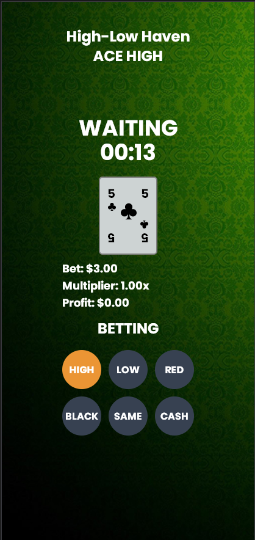

## Hilo
A simple digital casino card game for a school project. The rules are visible within the game's website.

### How To Run
`npm run build` - Build the NextJS app

`npm run start` - Start the NextJS app

`npm run socket` - Start the socket server

`npm run compute` - Compute stored data into a CSV file `socket/data.csv` 

### Requirements
* A redis server
* Server to host socket & webserver (change socket URL in `src/app/page.tsx`)

### Examples

